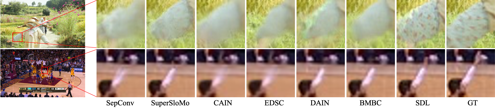
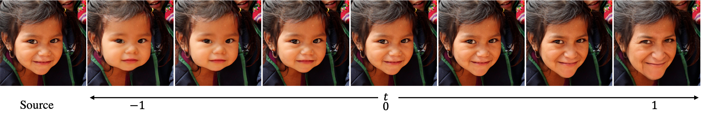
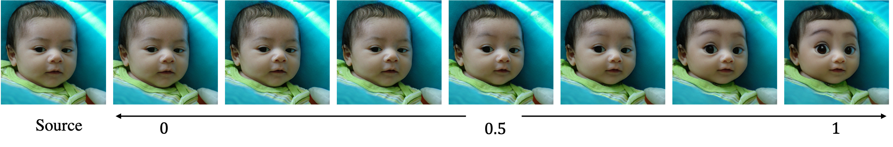
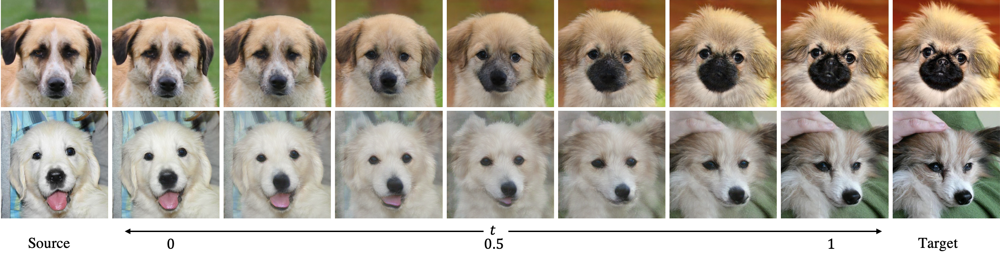
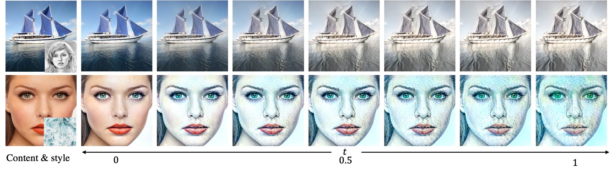

# Beyond a Video Frame Interpolator: A Space Decoupled Learning Approach to Continuous Image Transition

[Paper](https://arxiv.org/pdf/2203.09771) | Supplementary Material

[Tao Yang](https://cg.cs.tsinghua.edu.cn/people/~tyang)<sup>1</sup>, Peiran Ren<sup>1</sup>, Xuansong Xie<sup>1</sup>, Xiansheng Hua<sup>1</sup>, [Lei Zhang](https://www4.comp.polyu.edu.hk/~cslzhang)<sup>2</sup>  
_<sup>1</sup>[DAMO Academy, Alibaba Group](https://damo.alibaba.com), Hangzhou, China_  
_<sup>2</sup>[Department of Computing, The Hong Kong Polytechnic University](http://www.comp.polyu.edu.hk), Hong Kong, China_

### Video Frame Interpolation



### Face Aging



### Face Toonification



### Image Morphing



### Style Transfer



## News
(2022-4-11) Add source codes and pre-trained models.

## Usage


- Clone this repository.
```bash
git clone https://github.com/yangxy/SDL.git
cd SDL
```

- Install dependencies. (Python 3 + NVIDIA GPU + CUDA. Recommend to use Anaconda)
```bash
pip install -r requirements.txt
````

- Download our [pre-trained models](https://public-vigen-video.oss-cn-shanghai.aliyuncs.com/robin/models/SDL_models.zip?OSSAccessKeyId=LTAI4G6bfnyW4TA4wFUXTYBe&Expires=1961116085&Signature=GlUNW6%2B8FxvxWmE9jKIZYOOciKQ%3D) and unzip them into ``weights/``.

- Test our models.
```bash
python sdl_test.py --task vfi --model SDL_vfi_perceptual.pth --num 1 --source examples/VFI/frame_0.png --target examples/VFI/frame_1.png

python sdl_test.py --task morphing --model SDL_dog2dog_scale.pth --num 7 --size 512 --source examples/Morphing/dog_0.png --target examples/Morphing/dog_1.png

python sdl_test.py --task i2i --model SDL_aging_scale.pth --num 7 --size 512 --extend_t --source examples/I2I/face_0.png

python sdl_test.py --task style_transfer --model SDL_style_transfer_arbitrary.pth --num 7 --source examples/Style_transfer/content.png --target examples/Style_transfer/style.png
```

- Train SDL with 4 GPUs.
```bash
CUDA_VISIBLE_DEVICES=0,1,2,3 python -m torch.distributed.launch --nproc_per_node=4 --master_port=4321 train.py -opt options/train_SDL_VFI.yml --auto_resume --launcher pytorch #--debug

CUDA_VISIBLE_DEVICES=0,1,2,3 python -m torch.distributed.launch --nproc_per_node=4 --master_port=4321 train.py -opt options/train_SDLGAN_I2I.yml --auto_resume --launcher pytorch #--debug

CUDA_VISIBLE_DEVICES=0,1,2,3 python -m torch.distributed.launch --nproc_per_node=4 --master_port=4321 train.py -opt options/train_SDLGAN_Morphing.yml --auto_resume --launcher pytorch #--debug
```

- Prepare the training dataset by following this [instruction](datasets/README.md).

Please check out ``run.sh`` for more details.

## Citation
If our work is useful for your research, please consider citing:

    @inproceedings{Yang2022SDL,
	    title={Beyond a Video Frame Interpolator: A Space Decoupled Learning Approach to Continuous Image Transition},
	    author={Tao Yang, Peiran Ren, Xuansong Xie, Xiansheng Hua and Lei Zhang},
	    journal={arXiv:2203.09771},
	    year={2022}
    }
    
## License
© Alibaba, 2022. For academic and non-commercial use only.

## Acknowledgments
This project is built based on the excellent [BasicSR-examples](https://github.com/xinntao/BasicSR-examples) project.

## Contact
If you have any questions or suggestions about this paper, feel free to reach me at yangtao9009@gmail.com.

